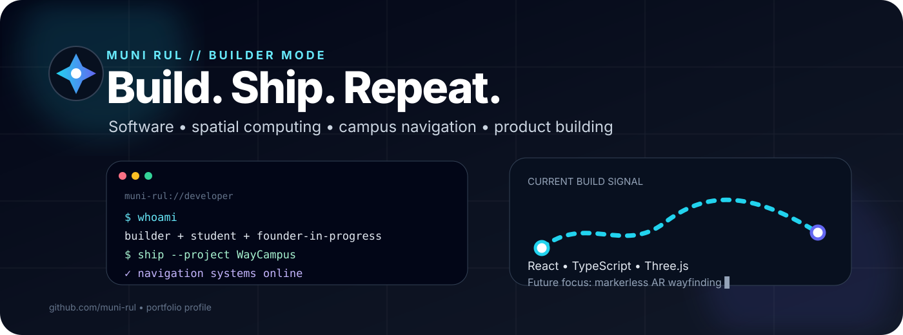

<!-- Munirul — GitHub Profile -->

  

  
  
  

  

---

## 👋 I build where software meets the real world

I'm **Munirul** — an **AI-assisted software developer, IoT developer, and product builder** focused on turning ideas into systems that people can actually use.

AI is part of my engineering workflow: I use it to explore architectures, prototype faster, investigate bugs, generate test ideas, document systems, and iterate on implementation. **The final system still has to work.**

My interests sit across:

**AI-assisted development · full-stack software · IoT · 3D interfaces · spatial computing · navigation systems · practical automation**

> **Build → test in the real world → learn → improve → ship.**

---

## 🧭 What I'm building

<table>
<tr>
<td width="50%" valign="top">

### WayCampus

A campus navigation platform combining route graphs, destination search, 360° panorama navigation, QR positioning, campus information, and operational tooling.

**Next direction:** multi-college deployment + markerless AR wayfinding.

<a href="https://campnav-b3om.onrender.com">Open the live build →</a>

</td>
<td width="50%" valign="top">

### IoT & connected systems

I enjoy building ideas where software meets sensors, devices, connectivity, and physical environments.

**Focus:** practical prototypes, automation, telemetry, device interaction, and systems that solve physical-world problems.

</td>
</tr>
</table>

---

## ⚙️ My build loop

<pre>
IDEA → EXPLORE → PROTOTYPE → BUILD → REAL-WORLD TEST → SHIP → REPEAT
             ↑
      AI as engineering copilot
</pre>

I don't treat AI output as the product. **The product is the working system that survives testing.**

---

## 🧰 My toolbox

### Software

  

### IoT / physical computing

  

### Exploring

<code>AI-assisted engineering</code> · <code>spatial computing</code> · <code>AR navigation</code> · <code>visual localization</code> · <code>multi-tenant products</code>

---

## 🧪 Things I care about

| Signal | Meaning |
|---|---|
| **Build** | Make the idea concrete. |
| **Accuracy** | Especially important when software guides people or devices. |
| **Usability** | A technically correct system is still bad if people can't use it. |
| **Reliability** | Test the real workflow, not just the happy path. |
| **Iteration** | Every failed prototype should make the next version better. |
| **Shipping** | A working product beats an unfinished perfect plan. |

---

## 📡 Current build board

<pre>
┌──────────────────────────────────────────────────────────┐
│ STATUS: ACTIVE                                           │
├──────────────────────────────────────────────────────────┤
│ ✓ WayCampus production foundation                        │
│ ✓ Navigation + 360° + QR positioning                    │
│ → Better product / developer workflows                  │
│ → Multi-college architecture                             │
│ → Markerless AR navigation research                      │
│ → More software × IoT experiments                        │
└──────────────────────────────────────────────────────────┘
</pre>

---

## 📊 GitHub telemetry

  
  

  

---

## 🔭 Where I'm heading

I'm building toward a career where **software, AI-assisted engineering, IoT, and spatial computing overlap**.

The long-term ambition is simple:

> **Build technology that is useful outside the screen.**

That means products people can navigate with, devices people can interact with, and systems that solve problems in the physical world.

---

## 🎮 A developer profile should feel like a workspace

<pre>
~/muni-rul

├── 🧠 ideas
├── 💻 software
├── 🔌 iot
├── 🧭 spatial
├── 🤖 ai-assisted workflow
├── 🚀 products
└── 📦 shipped

$ echo "keep building"
keep building▋
</pre>

---

## 🌐 Connect

  <a href="https://github.com/muni-rul">GitHub</a> ·
  <a href="https://www.instagram.com/munirul_s_k">Instagram</a>

---

  <strong>Build something real.</strong> 
  One idea · one prototype · one more commit.

