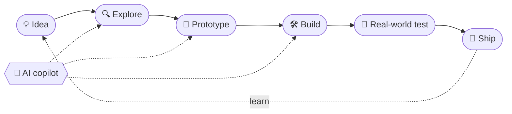

<!-- Munirul — GitHub Profile · place this file + profile-banner.svg in the root of the repo named `muni-rul` -->

  

  
  
  
  

  

---

## 👋 I build where software meets the real world

I'm **Munirul** — an **AI-assisted software developer, IoT developer and product builder**, focused on turning ideas into systems people can actually use.

AI is part of my engineering workflow. I use it to explore architectures, prototype faster, investigate bugs, generate test ideas, document systems and iterate on implementation.

> **The final system still has to work.**

**Interests:** AI-assisted development · full-stack software · IoT · 3D interfaces · spatial computing · navigation systems · practical automation

---

## 🧭 What I'm building

<table>
<tr>
<td width="50%" valign="top">

### 🗺️ WayCampus

A campus navigation platform that combines route graphs, destination search, 360° panorama navigation, QR positioning, campus information and operational tooling.

**Next:** multi-college deployment and markerless AR wayfinding.

**[Open the live build →](https://campnav-b3om.onrender.com)**

</td>
<td width="50%" valign="top">

### 🔌 IoT & connected systems

Ideas where software meets sensors, devices, connectivity and physical environments.

**Focus:** practical prototypes, automation, telemetry, device interaction and systems that solve physical-world problems.

</td>
</tr>
</table>

---

## ⚙️ My build loop

I don't treat AI output as the product. **The product is the working system that survives testing.**

---

## 🧰 Toolbox

**Software**

  

**IoT / physical computing**

  

**Exploring**

`AI-assisted engineering` · `spatial computing` · `AR navigation` · `visual localization` · `multi-tenant products`

---

## 🧪 What I care about

| | Principle | What it means |
|:-:|---|---|
| 🛠️ | **Build** | Make the idea concrete. |
| 🎯 | **Accuracy** | Critical when software guides people or devices. |
| 🧑‍💻 | **Usability** | A technically correct system is still bad if people can't use it. |
| 🛡️ | **Reliability** | Test the real workflow, not just the happy path. |
| 🔁 | **Iteration** | Every failed prototype should make the next version better. |
| 🚀 | **Shipping** | A working product beats an unfinished perfect plan. |

---

## 📡 Current build board

| Status | Track |
|:-:|---|
| ✅ | WayCampus production foundation |
| ✅ | Navigation + 360° + QR positioning |
| 🔨 | Better product and developer workflows |
| 🔨 | Multi-college architecture |
| 🔬 | Markerless AR navigation research |
| 🧪 | More software × IoT experiments |

✅ shipped · 🔨 in progress · 🔬 researching · 🧪 experimenting

---

## 📊 GitHub telemetry

  
  

  

---

## 🔭 Where I'm heading

I'm building toward a career where **software, AI-assisted engineering, IoT and spatial computing overlap.**

> **Build technology that is useful outside the screen.**

Products people can navigate with. Devices people can interact with. Systems that solve problems in the physical world.

---

## 🌐 Connect

  
  
  

  <strong>Build something real.</strong> 
  One idea · one prototype · one more commit.

